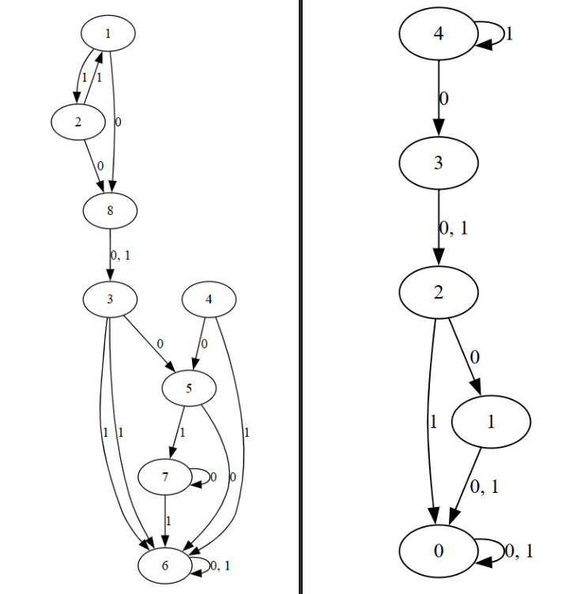

# Курс по теории автоматов

__Реализовано:__
1. Конечный автомат
2. Минимизация конечного автомата
3. Детерминизация конечного автомата
4. Распознователь

В репозитории представлены лабораторные работы Глухарева Степана за 3 курс. 
Формат входных данных для конечных автоматов описан ниже.

``` dot
digraph AutmoatonExample // Не обязательно, но всегда приятно
{
    start = 0; // Может быть только одно начальное состояние
    final = 2, 4; // Может быть несколько конечных вершин
    // GraphvizOnline - не поддерживает более однгого конечного состояния

    3 -> 1; // e-переход
    0 -> 1 [label = "a"];
    1 -> 2 [label = "b"];
    2 -> 3 [label = "c"]; // Обычные переходы
    3 -> 4 [label = "a, c"]; // Может быть несколько букв алфавита для перехода
}
```

Файлы для тестирования необходимо помещать в папку `/res/input`. Из заготовленных есть интересная проверка минимизации с примера сайта [itmo](https://neerc.ifmo.ru/wiki/index.php?title=%D0%9C%D0%B8%D0%BD%D0%B8%D0%BC%D0%B8%D0%B7%D0%B0%D1%86%D0%B8%D1%8F_%D0%94%D0%9A%D0%90,_%D0%B0%D0%BB%D0%B3%D0%BE%D1%80%D0%B8%D1%82%D0%BC_%D0%B7%D0%B0_O(n%5E2)_%D1%81_%D0%BF%D0%BE%D1%81%D1%82%D1%80%D0%BE%D0%B5%D0%BD%D0%B8%D0%B5%D0%BC_%D0%BF%D0%B0%D1%80_%D1%80%D0%B0%D0%B7%D0%BB%D0%B8%D1%87%D0%B8%D0%BC%D1%8B%D1%85_%D1%81%D0%BE%D1%81%D1%82%D0%BE%D1%8F%D0%BD%D0%B8%D0%B9).
Граф записан как файл `itmo.dot`. Можно ознакомиться с результатом минимизации на изображении ниже.



### Ссылки
1. [Визуализация `.dot` файлов](https://dreampuf.github.io/GraphvizOnline/?engine=dot)
2. [Успеваемость](https://docs.google.com/spreadsheets/d/1MveN0XK32TYu8BAC9km3E9S3hN0OByp5jz3-Hcmxu2I/edit?pli=1&gid=0#gid=0) 
3. [Критерии сдачи](https://docs.google.com/document/d/1XSP9ryvPh3p6PtoL_BeCKyvZUkwQ-PgJ4TsTu3HgLBA/edit?tab=t.o1x1jw4l5ks8)