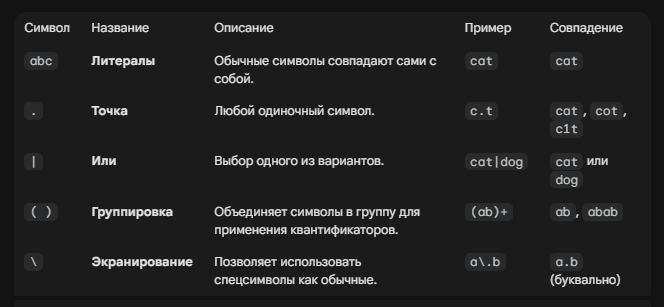
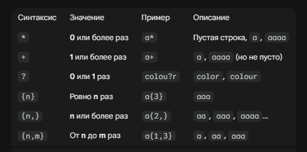
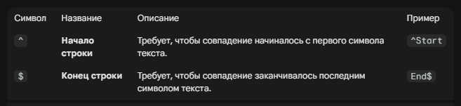
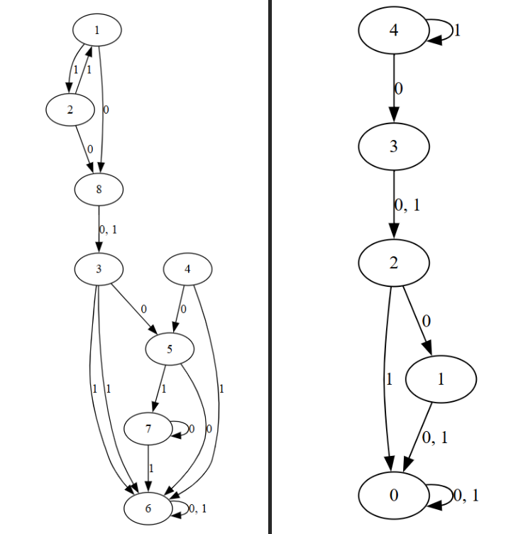

# Курс по теории автоматов

В репозитории представлены лабораторные работы Глухарева Степана за 3 курс.
Формат входных данных для конечных автоматов описан ниже.

__Реализовано:__

1. Конечный автомат
2. Минимизация конечного автомата
3. Детерминизация конечного автомата
4. Распознователь
5. Перевод грамматик в НКА
6. Перевод регулярных выражений в НКА
7. Перевод НКА в регулярные выражения

### Краткое руководство по библиотекам

Этот набор библиотек позволяет создавать, преобразовывать и анализировать Конечные Автоматы (КА) и Регулярные Грамматики (РГ).

##### Важное замечание о сборке

Многие утилиты (например, `AutomatonVisualizer::ExportToDot`) ожидают существования директории `res` в корневой папке запуска. Убедитесь, что она
создана, или проверьте `std::filesystem::current_path()`, чтобы понять, откуда запускается программа.

Как пользоваться библиотекой и как вывести информацию об автомате?

### Пример

```cpp
Automaton a;
a.SetTitle("Пример");
a.SetStartState(0);
a.AddFinalState(2);
a.AddTransition(0, 'a', 1);
a.AddTransition(1, 'b', 2);

// Проверка слов (с логированием шагов)
bool ok = a.Recognize("ab", true);

// Вывести информацию об автомате
AutomatonVisualizer::Display(a);
// Экспортировать в dot для Graphviz
AutomatonVisualizer::ExportToDot(a, "automaton.dot");
```

---

### Что важно знать

- Символы перехода — `Symbol` (`unsigned char`)
- `epsilon-transition` обозначено как `'e'` и в выводе отображается как `ε`
- Состояния — `State` (`unsigned int`)
- Для красивого текстового вывода используйте `AutomatonVisualizer::Display`
- Для визуализации в графе используйте `AutomatonVisualizer::ExportToDot`
- `PrintRecognize` и `TestStrings` удобны для логирования результатов распознавания большого кол-ва слов

| Что хочу сделать                  | Метод                                  |
|-----------------------------------|----------------------------------------|
| Проверить распознавание слова     | `Automaton::Recognize`                 |
| Протестировать набор слов         | `AutomatonVisualizer::TestStrings`     |
| Экспортировать в `.dot`           | `AutomatonVisualizer::ExportToDot`     |
| Вывести информацию об автомате    | `AutomatonVisualizer::Display`         |
| Проверить детерминированность     | `Automaton::IsDeterministic`           |
| Минимизировать автомат            | `MinimizationAlgorithm::Minimize`      |
| Детерминировать автомат           | `DeterminizationAlgorithm::Determine`  |
| Получить грамматику из файла      | `GrammarBuilder::FromFile`             |
| Проверить регулярна ли грамматика | `Grammar::IsRegular`                   |
| Получить тип грамматики           | `Grammar::GetLinearityType`            |
| Перевести грамматику в НКА        | `GrammarToNfaConverter::Convert`       |
| Перевести регулярную строку в НКА | `RegexConverterAdapter::Convert`       |
| Сгенерировать строки из регуляр.  | `RegexGenerator::GenerateRegexMatches` |
| Перевести НКА в регулярное выраж. | `AutomatonToRegexConverter::Convert`   |

### Формат вывода или ввода данных `.dot` файлов

``` dot
digraph AutmoatonExample // Не обязательно, но всегда приятно
{
    start = 0; // Может быть только одно начальное состояние
    final = 2, 4; // Может быть несколько конечных вершин
    // GraphvizOnline - не поддерживает более однгого конечного состояния

    3 -> 1; // e-переход
    0 -> 1 [label = "a"];
    1 -> 2 [label = "b"];
    2 -> 3 [label = "c"]; // Обычные переходы
    3 -> 4 [label = "a, c"]; // Может быть несколько букв алфавита для перехода
}
```

### Возможности регулярного выражения

Данный движок поддерживает подмножество стандартных регулярных выражений. Ниже приведен список всех доступных операторов и правил.




При записи регулярного выражения в строковом литерале C++ обратный слэш нужно удваивать.

```cpp
// Неправильно: 
// converter.Convert("a\.b", automaton); 

// Правильно:
converter.Convert("a\\.b", automaton); // Экранируем точку
```

#### Квантификаторы (Повторения)
Действуют на предыдущий символ или группу.



#### Якоря (Границы строки)


---

Файлы для тестирования необходимо помещать в папку `/res/input`. Из заготовленных есть интересная проверка минимизации с примера
сайта [itmo](https://neerc.ifmo.ru/wiki/index.php?title=%D0%9C%D0%B8%D0%BD%D0%B8%D0%BC%D0%B8%D0%B7%D0%B0%D1%86%D0%B8%D1%8F_%D0%94%D0%9A%D0%90,_%D0%B0%D0%BB%D0%B3%D0%BE%D1%80%D0%B8%D1%82%D0%BC_%D0%B7%D0%B0_O(n%5E2)_%D1%81_%D0%BF%D0%BE%D1%81%D1%82%D1%80%D0%BE%D0%B5%D0%BD%D0%B8%D0%B5%D0%BC_%D0%BF%D0%B0%D1%80_%D1%80%D0%B0%D0%B7%D0%BB%D0%B8%D1%87%D0%B8%D0%BC%D1%8B%D1%85_%D1%81%D0%BE%D1%81%D1%82%D0%BE%D1%8F%D0%BD%D0%B8%D0%B9).
Граф записан как файл `itmo.dot`. Можно ознакомиться с результатом минимизации на изображении ниже.



### Ссылки

1. [Визуализация `.dot` файлов](https://dreampuf.github.io/GraphvizOnline/?engine=dot)
2. [Успеваемость](https://docs.google.com/spreadsheets/d/1MveN0XK32TYu8BAC9km3E9S3hN0OByp5jz3-Hcmxu2I/edit?pli=1&gid=0#gid=0)
3. [Критерии сдачи](https://docs.google.com/document/d/1XSP9ryvPh3p6PtoL_BeCKyvZUkwQ-PgJ4TsTu3HgLBA/edit?tab=t.o1x1jw4l5ks8)